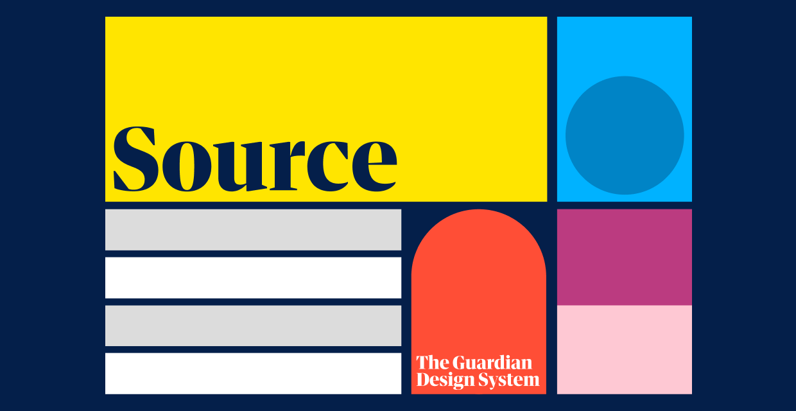

> A component library for the Guardian's [Source Design System](https://theguardian.design).

## Components ⚛️

See [the Source storybook](https://guardian.github.io/source) for examples of available components.

## Docs 📖

- [Getting started](https://guardian.github.io/source/?path=/story/getting-started--page)
- [Foundations](https://guardian.github.io/source/?path=/story/foundations--page)
- [Components](https://guardian.github.io/source/?path=/story/components--page)
- [Development Kitchen](https://guardian.github.io/source/?path=/story/development-kitchen--page)
- [ESLint plugins](https://guardian.github.io/source/?path=/story/eslint-plugins--page)

## Using the Source Design System 🎨

This component library makes it easy to implement user interfaces conforming to the Source Design System.

To understand how the Source Design System _works_, see the [Source Design System documentation](https://theguardian.design).

## Contributing 💝

We welcome contributions to the Source component library!

Before you begin, please read our
[Contributing Guidelines](https://guardian.github.io/source/?path=/story/contributing-overview--page)
