# `<Header />` component API

There is a plan to standardise headers across the Guardian's web products.

This proposal outlines an API that tries to capture the areas of standardisation while being as flexible as possible for end users.

> _See [the visual designs](https://www.figma.com/file/V8u2r27TFdjAWNM3p84ypC/%E2%9C%AD-Header?node-id=1989%3A71918) for more context._

## Example

```jsx
<Header>
    <Masthead>
        <Masthead.Links>
            <Masthead.Link href icon={<Icon />} label until from />
            <Masthead.Menu icon label until from>
                <Masthead.Link href label />
                <Masthead.Link href label />
            </Masthead.Menu>
            <Masthead.Link href icon={<Icon />} label until from />
        </Masthead.Links>
    </Masthead>
    <Navigation>
        <Navigation.Links>
            <Navigation.Link
                label="News"
                href="https://www.theguardian.com/news"
            />
        </Navigation.Links>
        <Navigation.Menu>
            <Navigation.MenuGroup>
                <Navigation.MenuLink
                    label="News"
                    href="https://www.theguardian.com/news"
                />
            </Navigation.MenuGroup>
            <Navigation.MenuGroup>
                <Navigation.MenuSupplementalLink
                    label="Masterclasses"
                    href="https://www.theguardian.com/guardian-masterclasses"
                />
            </Navigation.MenuGroup>
        </Navigation.Menu>
    </Navigation>
    <Subnav>
        <Subnav.Link
            label="UK politics"
            href="https://www.theguardian.com/politics"
        />
    </Subnav>
</Header>
```

## Component breakdown

### `<Header />`

Generic header component. The logo is hard-coded.


#### Example

```jsx
<Header>
    <Masthead />
    <Navigation />
    <Subnav />
</Header>
```

### `<Masthead />`

The area at the top of the header that houses features related to the brand and customisation, rather than content discovery. Examples include the support message, top level links, the Guardian logo and the Edition Switch.

The logo is hardcoded.


#### Example

```jsx
<Masthead.Links>
    <Masthead.Link href icon={<Icon />} label until from />
    <Masthead.Menu icon label until from>
        <Masthead.Link href label />
    </Masthead.Menu>
</Masthead.Links>
```

#### `<Masthead.Links />`

A list of top-level links and menus that is displayed at the very top of the header.

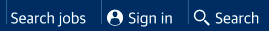

#### `<Masthead.Link />`

A link that is displayed in the `Masthead.Links` section of the header, or within a `Masthead.Menu` dropdown.


##### Props

-   `href` _string_
    -   navigation location when `Masthead.Link` is clicked
-   `onClick` _function_
    -   logic that is executed when the `Masthead.Link` is clicked
-   `label` _string_
    -   display label of the `Masthead.Link`
-   `icon` _ReactNode_
    -   icon that appears alongside the label
-   `from` _Breakpoint_
    -   the breakpoint at which the `Masthead.Link` becomes visible
-   `until` _Breakpoint_
    -   the breakpoint at which the `Masthead.Link` is no longer displayed

#### `<Masthead.Menu />`

A dropdown menu that is displayed in the `Masthead.Links` section of the header.

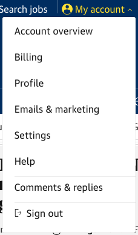

##### Props

-   `label` _string_
    -   display label of the `Masthead.Menu`
-   `icon` _ReactNode_
    -   icon that appears alongside the label
-   `from` _Breakpoint_
    -   the breakpoint at which the `Masthead.Menu` becomes visible
-   `until` _Breakpoint_
    -   the breakpoint at which the `Masthead.Menu` is no longer displayed

#### `<Masthead.Switch />`

A dropdown menu that allows the user to switch a high-level user setting. For example, the Edition Switch controls the default edition of the network front that is displayed when the user visit theguardian.com.

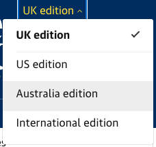

##### Example

```jsx
<Masthead.Switch
    onChange={() => {
        localStorage.setItem('edition', 'uk');
    }}
>
    <Masthead.SwitchItem
        href="https://www.theguardian.com/preference/edition/uk"
        label="UK edition"
        selected={true}
    />
    <Masthead.SwitchItem
        href="https://www.theguardian.com/preference/edition/us"
        label="US edition"
    />
</Masthead.Switch>
```

##### Props

-   `onChange` _function_
    -   callback for logic that runs when the selected switch item is changed

#### `<Masthead.SwitchItem />`

A link that appears in the Switch dropdown menu.

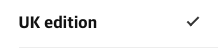

##### Example

```jsx
<Masthead.SwitchItem
    href="https://www.theguardian.com/preference/edition/uk"
    label="UK edition"
    selected={true}
/>
```

##### Props

-   `href` _string_
    -   Target URL for the `Masthead.SwitchItem`
    -   Navigation occurs after the `onChange` code has executed
-   `label` _string_
    -   display label of the `Masthead.SwitchItem`
-   `selected` _boolean_
    -   the currently selected `Masthead.SwitchItem`

### `<Navigation />`

The top-level navigation menu.

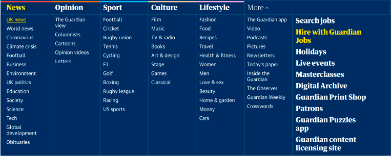

#### Example

```jsx
<Navigation>
    <Navigation.Links>
        <Navigation.Link label="News" href="https://www.theguardian.com/news" />
    </Navigation.Links>
    <Navigation.Menu>
        <Navigation.MenuGroup>
            <Navigation.MenuLink
                label="News"
                href="https://www.theguardian.com/news"
            />
        </Navigation.MenuGroup>
    </Navigation.Menu>
</Navigation>
```

#### `<Navigation.Links />`

The main visible navigational links

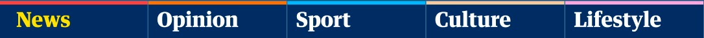

##### Example

```jsx
<Navigation.Links>
    <Navigation.Link label="News" href="https://www.theguardian.com/news" />
</Navigation.Links>
```

##### `<Navigation.Link />`

A navigational link that appears in the `Navigation.Links` component

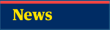

###### Example

```jsx
<Navigation.Link
    label="News"
    href="https://www.theguardian.com/news"
    color={palette.news[400]}
    selected={true}
/>
```

###### Props

-   `href` _string_
    -   navigation location when `Navigation.Link` is clicked
-   `label` _string_
    -   display label of the `Navigation.Link`
-   `color` _string_
    -   hex value of the coloured selection indicator
-   `selected` _boolean_
    -   toggles the top link’s selection indicator

#### `<Navigation.Menu />`

An expanding menu that opens on click of the veggie burger icon, or the "more" link at wider breakpoints

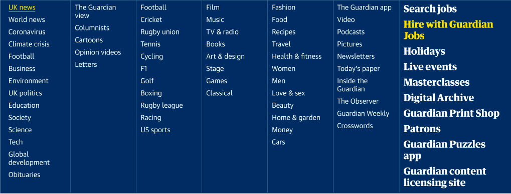

##### Example

```jsx
<Navigation.Menu>
    <Navigation.MenuGroup>
        <Navigation.MenuLink
            label="News"
            href="https://www.theguardian.com/news"
        />
    </Navigation.MenuGroup>
    <Navigation.MenuSupplementalLink
        label="Masterclasses"
        href="https://www.theguardian.com/guardian-masterclasses"
    />
</Navigation.Menu>
```

##### `<Navigation.MenuGroup />`

A column of links within the `SecondaryLinks` panel

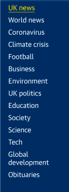

###### Example

```jsx
<Navigation.MenuGroup>
    <Navigation.MenuLink
        label="UK news"
        href="https://www.theguardian.com/uk"
    />
    <Navigation.MenuLink
        label="World news"
        href="https://www.theguardian.com/world"
    />
</Navigation.MenuGroup>
```

###### `<Navigation.MenuLink />`

A navigational link that appears in the `Navigation.Menu` component


###### Props

-   `href` _string_
    -   navigation location when `Navigation.MenuLink` is clicked
-   `label` _string_
    -   display label of the `Navigation.MenuLink`

###### Example

```jsx
<Navigation.MenuLink
    label="World news"
    href="https://www.theguardian.com/world"
/>
```

##### `<Navigation.MenuSupplementalLink />`

A visually prominent navigational link that appears in the `Navigation.Menu` component.


###### Example

```jsx
<Navigation.MenuSupplementalLink
    label="Masterclasses"
    href="https://www.theguardian.com/guardian-masterclasses"
/>
```

###### Props

-   `href` _string_
    -   navigation location when `Navigation.MenuSupplementalLink` is clicked
-   `label` _string_
    -   display label of the `Navigation.MenuSupplementalLink`

### `<Subnav />`

A navigation for sub-categories below the current top-level category.

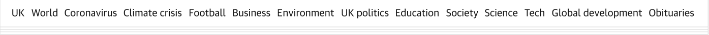

#### Example

```jsx
<Subnav>
    <Subnav.Link
        label="UK"
        href="https://www.theguardian.com/uk"
    / >
    <Subnav.Link
        label="World"
        href="https://www.theguardian.com/world"
    / >
<Subnav/>
```

#### `<Subnav.Link />`

A navigational link that appears in the `Subnav` component

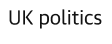

##### Example

```jsx
<Subnav.Link label="UK politics" href="https://www.theguardian.com/politics" />
```

##### Props

-   `href` _string_
    -   navigation location when `Subnav.Link` is clicked
-   `label` _string_
    -   display label of the `Subnav.Link`

## Specialised headers

### `<EditorialHeader />`

A special header layout for editorial pages. The logo is hard-coded.

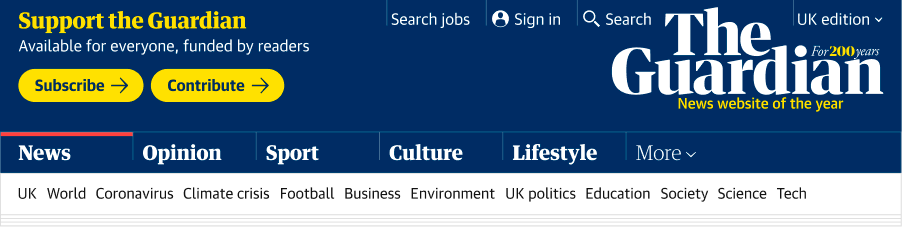

#### Differences to generic header

##### Masthead

-   Links to the left, floated right
-   Editions dropdown to the right
-   My account / sign in
    -   Links hierarchy
    -   Primary link – always visible
    -   Secondary links – visible at wider breakpoints
    -   Editions menu
-   Subscribe / Contribute links

#### Example

```jsx
<EditorialHeader>
    <Masthead>
        <EditorialHeader.Support />
        <Masthead.Links>
            <Masthead.Link href icon={<Icon />} label until from />
            <Masthead.Menu icon label until from>
                <Masthead.Link href label />
                <Masthead.Link href label />
            </Masthead.Menu>
            <Masthead.Link href icon={<Icon />} label until from />
        </Masthead.Links>
        <Masthead.Switch onChange>
            <Masthead.SwitchItem href label />
            <Masthead.SwitchItem href label selected />
            <Masthead.SwitchItem href label />
        </Masthead.Switch>
    </Masthead>
    <Navigation />
    <Subnav />
</EditorialHeader>
```

#### Props

-   `edition` _string_ `'uk'` | `'au'` | `'us'` | `'international'`

#### `<EditorialHeader.Support />`

Presents a message thanking supporters, or encouraging the reader to become a supporter.
The heading, subheading and buttons can be customised.


#### Props

-   `heading` _string_
    -   Text for the heading
-   `subheading` _string_
    -   Text for the subheading
-   `primaryCta` _{ ctaUrl: string; ctaText: string }_
    -   URL and button label for the primary call to action
-   `secondaryCta` _{ ctaUrl: string; ctaText: string }_
    -   URL and button label for the secondary call to action

## Risks and uncertainty

-   The support buttons / thank you message is delivered by Automat
    -   What is the state of Automat? Will it continue to be maintained, or should we take the opportunity to simplify?
    -   Currently in support-dotcom-components. Should the component code live in Source?
-   Client side rendered consumers will have to ship multiple logos, or they would have to lazy load the correct SVG
-   How much can we hardcode?
    -   Logos
    -   Editions switch
    -   Support messaging
    -   Masthead links
        -   Do we hardcode the URLs or should platforms control the actual links?
-   Should Source be aware of / managing Islands?
    -   We need to avoid re-rendering the entire header on the client because Nav is pretty huge, and doesn’t need to be dynamic
    -   Should we be imposing the Island architecture on all platforms?
    -   Could we allow consumers to compose their own header
        -   Via props
        -   `<EditorialHeader masthead={<Island><Masthead /></Island>} />`
